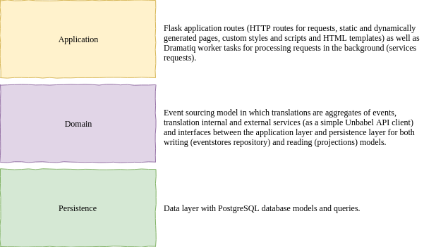
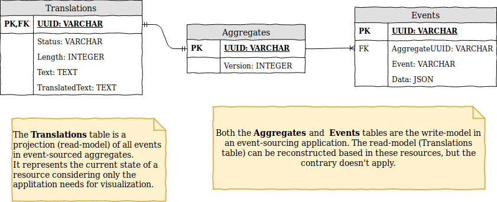
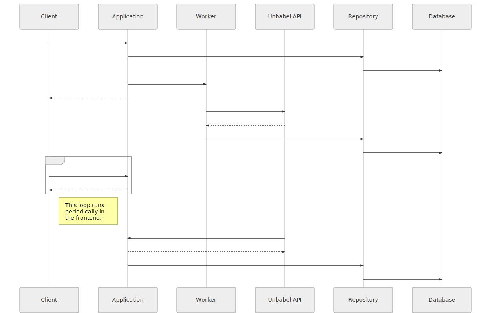
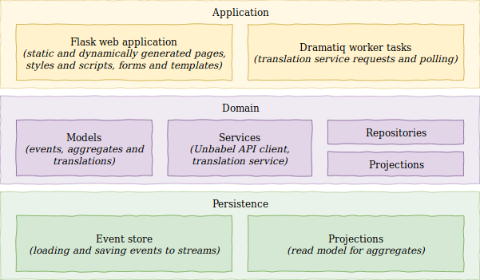

# Unbabel Backend Challenge

Hi, Unbabel recruiting team!

This is my solution (_work in progress_) to the [Unbabel Backend Challenge](https://github.com/Unbabel/backend-coding-challenge).

I've built a Flask web application which translates input text from English to Spanish using Unbabel's Translation API and presents it in a list of translations dynamically updated with 3 different statuses: requested, pending and translated.

## TL;DR

Stop local PostgreSQL service to avoid port conflicts, set `.env` environment variables and run:

```bash
docker-compose up -f docker-compose.yml --build --force-recreate
```

#### To do:

* Better error handling.
* Dynamic updates for the frontend.
* Implement tests.
* Write documentation.


## Roadmap and references

Here, I try to break the steps I took to develop this challenge solution - which is described later in this document.

My references are linked here alongside with the roadmap topics - some I have already implemented in other projects, and some I had to study for this challenge.

1. Fork the project and start feature branches using something like [Karma git](https://karma-runner.github.io/3.0/dev/git-commit-msg.html). **[OK]**
2. Implement a simple [Unbabel API](https://developers.unbabel.com/) client. **[OK]**
3. Test the Unbabel's API client. **[OK]**
4. Implement the Event Sourcing model (following this [blog post](https://breadcrumbscollector.tech/implementing-event-sourcing-in-python-part-1-aggregates/)). **[OK]**
5. Test (unit) the Event Sourcing model with [Hypothesis](https://hypothesis.readthedocs.io/en/latest/). **[OK]**
6. Implement the Event Sourcing persistence (see this [blog post](https://breadcrumbscollector.tech/implementing-event-sourcing-in-python-part-2-robust-event-store-atop-postgresql/)). **[OK]**
7. Test (unit) the Event Sourcing persistence. 
8. Review good practices for bootstraping a Flask application ([Flask Mega-tutorial](https://blog.miguelgrinberg.com/post/the-flask-mega-tutorial-part-i-hello-world)). **[OK]**
9. Implement a simple Flask application which runs locally. **[OK]**
10. Configure a simple `docker-compose`. **[OK]**
11. Implement a Dramatiq worker. **[OK]**
12. Study a production server (see [gunicorn](http://docs.gunicorn.org/en/stable/design.html)). **[OK]**
13. Improve the docker-compose configuration. **[OK]**
14. Improve the application frontend. **[OK]**
15. ~~Implement an event queue for the frontend (try [Flask-SSE](https://flask-sse.readthedocs.io/en/latest/quickstart.html)). **[OK]**~~
16. Implement dynamic updates for the frontend with polling. **[OK]**
17. Study how to test Flask applications.
18. Test (functional) the Flask application.
19. Improve error handling. **[OK]**
20. Improve environment variables and configuration. **[OK]**
21. Replace resource polling with a callback to an URL if an environment variable is set. **[OK]**
22. Test application performance with [JMeter](https://jmeter.apache.org/) or [Locust](http://www.sphinx-doc.org/en/master/).
23. Properly document everything with _docstrings_. **[OK]**
24. Generate beautiful documentation with [Sphinx](http://www.sphinx-doc.org/en/master/).
25. Write a great README. **[OK]**
26. Reorganize commits with `git rebase`.
27. Deliver it.

## Solution design

I've designed the application in a simple domain-driven approach trying to keep the Flask application (_application layer_), the translations logic (_domain layer_) and the data operations (_persistence layer_) isolated. The following diagram summarizes the architecture described in the next sessions.



### Application layer

My Flask reference is [Miguel Grinberg's Flask Mega-Tutorial book](https://blog.miguelgrinberg.com/post/the-flask-mega-tutorial-part-i-hello-world) which I have initially followed but as it uses available Flask extensions for everything, it makes too difficult to decouple the application layers.

For settings management I am using `dynaconf` and its Flask extension. For the background tasks, I let `Dramatiq` handle the queues using `Redis`. For the frontend, I am using `Flask-Bootstrap` styles and `Flask-WTF` forms and `Flask-SSE` (also with `Redis`) to notify all clients when there are changes in the translations list.

### Domain layer

For the translation services, I've chosen an event-sourcing approach (based on [this series of blog posts](https://breadcrumbscollector.tech/implementing-event-sourcing-in-python-part-1-aggregates/)) to properly handle the translation service status changes. My interpretation of the problem suggests the following logic:

* **requested:** As soon as an input text is submitted to our application, it is considered a _requested_ translation.
* **pending:** After sent to a translation service (in our case it's Unbabel API), its status changes from _requested_ to _pending_ and we have to wait until its completion (we are requesting manual translations).
* **finished:** When the translation service completes processing the input text (translatig it from English to Spanish), our translation status changes to _finished_.

All status changes are recorded as events in an event aggregate (which is a `Translation` object). This way, instead of having only the final state of an object, we can track down every modification (e.g. timestamps) and add other events to the logic in the future (other translation services appending to the events stream - internal x external services, automatic x manual services, etc).

To query and visualize this information, though, I've implemented a simple _read-model_ of the event-sourced aggregate containing the current state of every translation and required information as the string length for ordering the translations list.

### Persistence layer

The persistence layer is implemented with `SQLAlchemy` and a PostgreSQL database.

> **Note:** _Currently, we have a PostgreSQL container running with the same `docker-compose` as the application. This is definetely not the best approach - the schema and tables are recreated everytime (or persisted in an external volume).
> 
> This can be changed in the `.env` file containing the database URI environment variable, using a proper hosted PostgreSQL database.

The write-model for event-sourcing is implemented with 2 tables. One for **Aggregates** and another for **Events**. The read-model for visualization (which can be generated from the write-model on demand) is a single **Translations** table. Other projections could be added (e.g. read-models for management, auditing or analytics).

The following schema represents the implemented challenge schema.



> **Note:** The `Version` column in the Aggregates table is used as an optimistic lock - if 2 transactions attempt to update the same resource, the first one will complete and increment this value. Then, the second will try to update a version that doesn't exist anymore and fail. It's a simple mechanism of robustness

## Application steps

The following sequence diagram is a simple "_good path_"-only diagram illustrating the most important components calls and behaviors. It doesn't cover all paths (e.g. ignoring error handling) and it doesn't include the read-model (_projections_) when updating clients. Although, it's a good "mind map" of what is happening when a new translation is requested in a browser and sent to our application.



## Project organization

### Revision control

This project follows a [Karma git](https://karma-runner.github.io/3.0/dev/git-commit-msg.html)-sh commit messages and branches guidelines.

The single _production_, _staging_ and _development_ branches is avoided and feature branches are used instead.

As soon as feature branches are merged into master, they are removed. Unfortunately, no PRs and code reviews were opened during development - thus, there is no register of these merges. (_As I was developing all by myself, I've forgotten how useful it could be. Shame on me!_)

"_Baby steps_" commits are recommended, but unfortunately (_Again... Shame on me!_) a bunch of them are huge and contain too much changes to be reviewed in a single pass.

> **Note:** I'll try to re-organize commits with `git rebase ` and improve the challenge reviewers experience.

### Source Code

The _root_ directory contains all configuration files required:

* `.gitignore`;
* `requirements.txt` with required Python packages;
* `.env` with environment variables for Flask, Dynaconf and Docker as well;
* `docker-compose` files  and `Dockerfile` for building, testing and deploying the application.

And documentation:

* This `README.md` file and its `resources`;
* ~~Sphinx `docs`.~~

The application is developed as a `challenge` package and, as described above, it isolates the web application from the application domain and data persistence layers. The following image illustrates it with more details.



### Build, tests and deploy

The whole application and tests run inside a Docker container and a `docker-compose` file with it and other dependencies (Redis and PostgreSQL) is already prepared for building, testing and deploying without too much hassle.

* Before trying it, one has to fill the gaps in the `.env`file - as I'm not versioning API keys or callback URL.

To run the tests:

```bash
docker-compose up -f docker-compose.tests.yml --build --force-recreate
```

To run the application:

```bash
docker-compose up -f docker-compose.yml --build --force-recreate
```