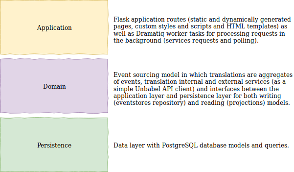
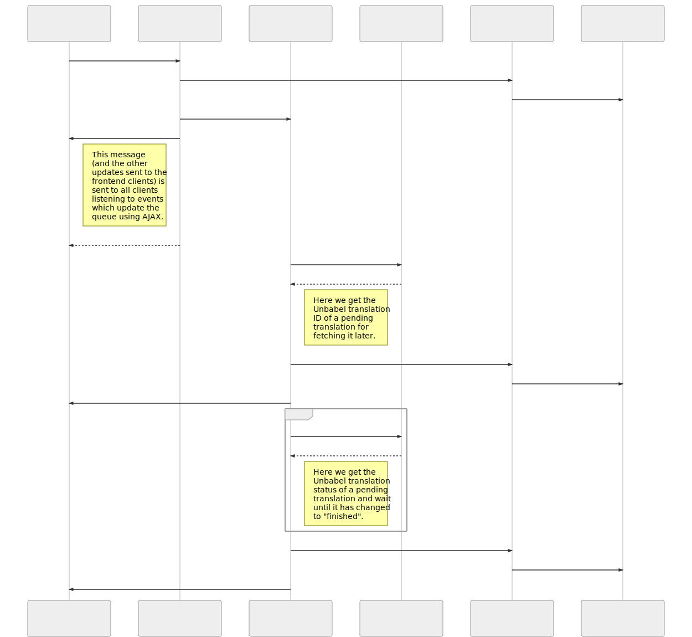

# Unbabel Backend Challenge

Hi, Unbabel recruiting team!

This is my solution to the [Unbabel Backend Challenge](https://github.com/Unbabel/backend-coding-challenge).

I've built a Flask web application which translates input text from English to Spanish using Unbabel's Translation API and presents it in a list of translations dynamically updated with 3 different statuses: _requested_, _pending_ and _translated_.

I've chosen a domain-driven architecture with event-sourcing for handling and persisting the translation status changes. All network tasks are running in the background and a cache is used for enqueing these messages. There are tests implemented for the domain layer - covering the translation services, event-sourcing model and repositories.

The application builds in a Docker container and runs with docker-compose.

Documentation consists on this README.md and source code documentation (_docstrings_).

## Requirements

* [Docker](https://www.docker.com/)
* [docker-compose](https://docs.docker.com/compose/)
* [ngrok](https://ngrok.com/) (_optional_ for HTTP tunneling and receiving callbacks)

## TL;DR

* Start `ngrok`on HTTP port 5000:

  ```bash
  ./ngrok http 5000
  ```

* Copy the `.env.template` to a `.env` file and set the required environment variables.

* Run the application:

```bash
docker-compose up -f docker-compose.yml --build --force-recreate
```

* Access it:

  http://localhost:5000/

## Roadmap and references

Here I try to break the steps I took to develop the solution - which is described later in this document.

My references are linked here alongside with the roadmap topics - some I've already implemented for other projects and some I've had to study for this challenge.

1. Fork the project. **[OK]**
2. Implement a simple [Unbabel API](https://developers.unbabel.com/) client. **[OK]**
3. Test the Unbabel's API client. **[OK]**
4. Implement the Event Sourcing model (following this [blog post](https://breadcrumbscollector.tech/implementing-event-sourcing-in-python-part-1-aggregates/)). **[OK]**
5. Test the Event Sourcing model with [Hypothesis](https://hypothesis.readthedocs.io/en/latest/). **[OK]**
6. Implement the Event Sourcing persistence (see this [blog post](https://breadcrumbscollector.tech/implementing-event-sourcing-in-python-part-2-robust-event-store-atop-postgresql/)). **[OK]**
7. Test the Event Sourcing persistence.  **[OK]**
8. Study a Flask web application ([Flask Mega-tutorial](https://blog.miguelgrinberg.com/post/the-flask-mega-tutorial-part-i-hello-world)). **[OK]**
9. Implement a simple Flask web application. **[OK]**
10. Configure a simple docker-compose. **[OK]**
11. Implement a Dramatiq worker. **[OK]**
12. Study a production server (see [gunicorn](http://docs.gunicorn.org/en/stable/design.html)). **[OK]**
13. Improve the docker-compose. **[OK]**
14. Implement the application frontend. **[OK]**
15. ~~Implement an event queue for the frontend (try [Flask-SSE](https://flask-sse.readthedocs.io/en/latest/quickstart.html)).~~
16. Implement dynamic updates for the frontend with AJAX polling. **[OK]**
17. ~~Study how to test Flask applications.~~
18. ~~Test the Flask application.~~
19. Implement a callback. **[OK]**
20. Improve error handling. **[OK]**
21. Improve environment variables and configuration. **[OK]**
22. ~~Test application performance with [JMeter](https://jmeter.apache.org/) or [Locust](http://www.sphinx-doc.org/en/master/).~~
23. Write _docstrings_. **[OK]**
24. ~~Generate HTML documentation with [Sphinx](http://www.sphinx-doc.org/en/master/).~~
25. Write a README. **[OK]**
26. Organize commits with `git rebase` and clean feature branches. **[OK]**
27. Deliver it. **[OK]**

## Solution design

I've designed the application in a simple domain-driven approach trying to keep the Flask application (_application layer_), the translations logic (_domain layer_) and the data operations (_persistence layer_) isolated. The following diagram summarizes the architecture described in the next sessions.



### Application layer

My Flask reference is [Miguel Grinberg's Flask Mega-Tutorial book](https://blog.miguelgrinberg.com/post/the-flask-mega-tutorial-part-i-hello-world) which I have initially followed but as it uses available Flask extensions for everything, it makes too difficult to decouple the application layers.

For settings management I am using `dynaconf` and its Flask extension. For the background tasks, I let `Dramatiq` handle the queues using `Redis` cache just because it's simple to configure - but I could have used RabbitMQ as well.

For the frontend, I am using `Flask-Bootstrap` styles, `Flask-WTF` forms and AJAX to poll the translations list.

An attempt of using `Flask-SSE` to notify all clients with changes instead of AJAX polling failed - it couldn't connect to the same `Redis` cache as `Dramatiq`. Configuring 2 `Redis` instances with `docker-compose` was taking me too much time, an alternative would be using RabbitMQ for the tasks and Redis for the frontend cache instead.

### Domain layer

For the translation services, I've chosen an event-sourcing approach (based on [this series of blog posts](https://breadcrumbscollector.tech/implementing-event-sourcing-in-python-part-1-aggregates/)) to properly handle the translation service status changes. My interpretation of the problem suggests the following logic:

* **requested:** As soon as an input text is submitted to our application via the HTML forms, it is considered a _requested_ translation.
* **pending:** After sent to a translation service (in our case it's Unbabel API), its status changes from _requested_ to _pending_ and we have to wait until its completion (as we are requesting manual translations).
* **finished:** When the translation service completes processing the input text (translating it from English to Spanish) and sends a POST to a callback URL in the application, our translation status changes to _finished_.

All status changes are recorded as events in an event aggregate (which is a `Translation` object). This way, instead of having only the final state of an object, we can track down every modification (e.g. timestamps) and add other events to the logic in the future (other translation services appending to the events stream - internal x external services, automatic x manual services, etc).

To query and visualize this information, though, I've implemented a simple _read-model_ of the event-sourced aggregate containing the current state of every translation and required information as the string length for ordering the translations list.

### Persistence layer

The persistence layer is implemented with `SQLAlchemy` and a PostgreSQL database.

> **Note:** _Currently, we have a PostgreSQL container running within the same `docker-compose` the application runs. This is definetely not the best approach - the schema and tables are recreated everytime (or persisted in an external volume).
>
> _This setup could be easily changed in the `.env` file assigning to a proper hosted PostgreSQL database to the database URI environment variable instead._

The write-model for event-sourcing is implemented with 2 tables. One for **Aggregates** and another for **Events**. The read-model for visualization (which can be generated from the write-model on demand) is a single **Translations** table. Other projections could be added (e.g. read-models for management, auditing or analytics).

The following schema represents the implemented challenge schema.


> **Note:** The `Version` column in the Aggregates table is used as an optimistic lock - if 2 transactions attempt to update the same resource, the first one will complete and increment this value. Then, the second will try to update a version that doesn't exist anymore and fail. It's a simple mechanism of robustness

## Application steps

The following sequence diagram is a simple "_good path_"-only diagram illustrating the most important components calls and behaviors. It doesn't cover all paths (e.g. ignoring error handling) and it doesn't include the read-model (_projections_) when updating clients. Although, it's a good "mind map" of what is happening when a new translation is requested in a browser and sent to our application.



## Project organization

### Revision control

This project follows a [Karma git](https://karma-runner.github.io/3.0/dev/git-commit-msg.html)-sh style for commit messages.

The single _production_, _staging_ and _development_ branches is avoided and feature branches were used instead.

As soon as feature branches are merged into master, they were removed. Unfortunately, no PRs and code reviews were opened during development. (_As I was developing all by myself, I've forgotten how useful it could be._)

"_Baby steps_" commits are recommended, but unfortunately (_Shame on me!_) a bunch of them are huge and contain too much changes to be reviewed in a single pass. Usually, it gets better after a large project is already up and running.

> **Note:** I'll try to re-organize commits with `git rebase ` and improve the challenge reviewers experience.

### Source Code

The _root_ directory contains all configuration files required:

* `.gitignore `and `.dockerignore`;
* `requirements.txt` with required Python packages;
* `.env.template` with environment variables which must be set before running;
* `docker-compose.yml` files  and `Dockerfile` for building and deploying the application;
* `docker-compose.tests.yml` and `Dockerfile` files for building and testing the application.

And documentation:

* This `README.md` file and its `resources`.

The application is developed as a `challenge` package and, as described above, it isolates the web application from the application domain and data persistence layers. The following image illustrates it with more details.


For development, I've used `virtuallenvwrapper` and Visual Studio Code. All Python files were *linted* with `Flake8` (which is faster), `pylint` (which covers more issues), `pydocstrings`, formatted with `yapf` and `isort`.

### Tests

_As time ran short and I still need to learn how to properly test a web application from end-to-end_, I've decided to test the core of this project, focusing on the happy path. There are no tests implemented for the application layer or persistence layer, but the essential classes of the domain layer were tested:

* The Unbabel's API client;
* The Translator service;
* The event-sourcing model (Aggregates, Events and Translations);
* The event-source aggregates Repository class.

Not all tests are isolated unit tests - this way testing the repository also stresses PostgreSQL queries from the Persistence layer, for instance. Most of these tests were implemented with `Hypothesis` Python package, which does a good job automatically generating tests cases (and corner cases).

The frontend tests are excluded as the application routes, templates and read-model. Studying `Selenium` could apply here.

A simple browser debugger or extension is capable of returning the average load time of the application `/index`page - which is around 150 ms. A better approach would be test it with `Locust` or `JMeter` and do a proper analysis - scaling worker processes and threads as necessary.

### Build, tests and deploy

There are `docker-compose` files for running both the application and tests with their dependencies (Redis and PostgreSQL). To do so, follow these steps:

1. Start an HTTP tunnel to the local port 5000 - the Unbabel's API will need a callback URL. I'm using [ngrok](https://ngrok.com/), but there are other solutions available.

```bash
./ngrok http 5000
```

2. Edit the `.env.template` file with the required environment variables (see the following snippet). Save it as `.env`.

```bash
###############################################################################
# CONFIGURE THE FOLLOWING ENVIRONMENT VARIABLES BEFORE RUNNING!
###############################################################################

# API client
UNBABEL_API_CLIENT=

# API token
UNBABEL_API_TOKEN=

# API callback URL. Please, consider the following:
#    - The format MUST be 'http[s]://<host>/callback/' (with quotes).
#    - The host might be a Ngrok HTTP tunnel to your local port 5000.
#    - The endpoint MUST be "callback" as it's implemented this way.
#    - The last slash ("/") MUST be explicit
UNBABEL_API_CALLBACK=

###############################################################################
# DO NOT EDIT ANYTHING FROM NOW ON
###############################################################################

...

```

3. Run tests.

```bash
docker-compose up -f docker-compose.tests.yml --build --force-recreate
```

After finishing, you will need to stop the docker-container by yourself (`CTRL + C` will do).

```bash
challenge_app | =================== test session starts ====================
challenge_app | platform linux -- Python 3.6.7, pytest-4.1.0, py-1.7.0, pluggy-0.8.0
challenge_app | hypothesis profile 'default' -> database=DirectoryBasedExampleDatabase('/src/.hypothesis/examples')
challenge_app | rootdir: /src, inifile:
challenge_app | plugins: hypothesis-3.86.5
challenge_app | collected 28 items
challenge_app | 
challenge_app | tests/domain/test_repositories.py ..                                     [  7%]
challenge_app | tests/domain/model/test_base.py .....                                    [ 25%]
challenge_app | tests/domain/model/test_translation.py ...........                       [ 64%]
challenge_app | tests/domain/services/test_translator.py ...                             [ 75%]
challenge_app | tests/domain/services/unbabel/test_client.py .......                     [100%]
challenge_app | 
challenge_app | ===================== warnings summary =====================

...

challenge_app | ========= 28 passed, 4 warnings in 111.67 seconds ==========
challenge_app exited with code 0

```

4. Run the application.

```bash
docker-compose up -f docker-compose.yml --build --force-recreate
```

5. Access the application using the HTTP tunnel or http://localhost:5000/


## Known Issues (or Next Steps)

The following issues are known and yet to be fixed:

* `Redis` is used as a message queue for the background workers without too much configuration. It's not reliable even though `Dramatiq` is managing it. A better solution would required properly configuring a message queue system as `RabbitMQ` and adding it to the `docker-compose` files.
* After some time, the AJAX polling loses connection with the PostgreSQL database. It requires further investigation, but implementing the event server with `Flash-SSE` could do.
* After the translations list is dynamically updated, the "Newer translations" and "Older translations" buttons are not. It's required to refresh the page after 10 entries to do so.
* Escape characters are returned from the PostgreSQL, sent to the translation services and printed in the frontend as well. Some translators deal with it, others don't.
* There are no control over requests (to the databases or APIs). `Tenacity` could be of help.
* There are insufficient tests for the application and persistence layer.
* There are no stress tests to say the application is scalable.